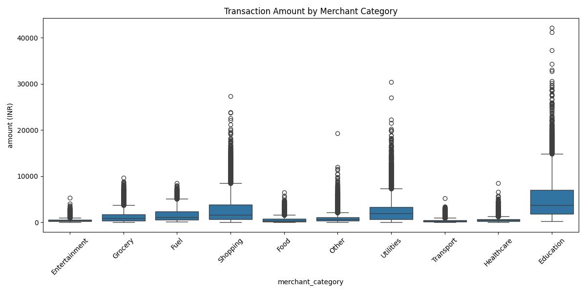

# 📊 UPI Transaction Analysis

This project performs an in-depth analysis of UPI (Unified Payments Interface) transaction data. The goal is to extract meaningful insights and visualize transaction patterns using various Python libraries like Pandas, Matplotlib, Seaborn, and Plotly.

## 📂 Project Files

* `upi_transactions_2024.CSV`: The raw dataset containing UPI transaction records.
* `deep_analysis _on_upi_trn.py`: A Python script that performs data cleaning, feature engineering, and generates several visualizations to analyze the transaction data.
* `UPI_ANALYSIS.PY`: An older version of the analysis script, which generates a subset of the visualizations.
* `.html` and `.png` files: These files are the output visualizations generated by the Python scripts.

## 📈 Analysis and Visualizations

The `deep_analysis _on_upi_trn.py` script performs the following analyses and generates corresponding visualizations:

* **Transaction Heatmap** 🔥: A heatmap showing the concentration of transactions by the day of the week and hour of the day.
* **Total Spending by Merchant Category** 🛒: An interactive bar chart showing the total amount spent across different merchant categories.
* **Monthly Spending Trend** 📊: A line chart that visualizes the total UPI spending trend over each month.
* **Transaction Type by Day** 🗓️: A stacked bar chart that breaks down the count of different transaction types for each day of the week.
* **Transaction Amount Distribution** 📉: A histogram illustrating the frequency distribution of transaction amounts.
* **Transaction Type Breakdown** 🥧: A pie chart showing the proportion of different transaction types (e.g., credit, debit) in the dataset.
* **Spending Variation by Merchant Category** 📦: A box plot that shows the spread and distribution of transaction amounts for each merchant category, identifying potential outliers.
* **Treemap for Category Spending** 🌳: An interactive treemap visualization that represents spending proportions by merchant category in a hierarchical view.